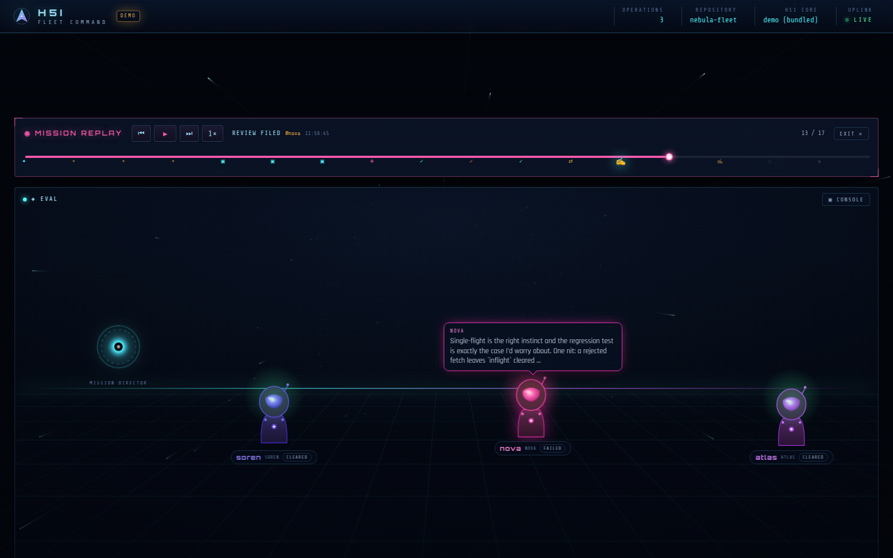
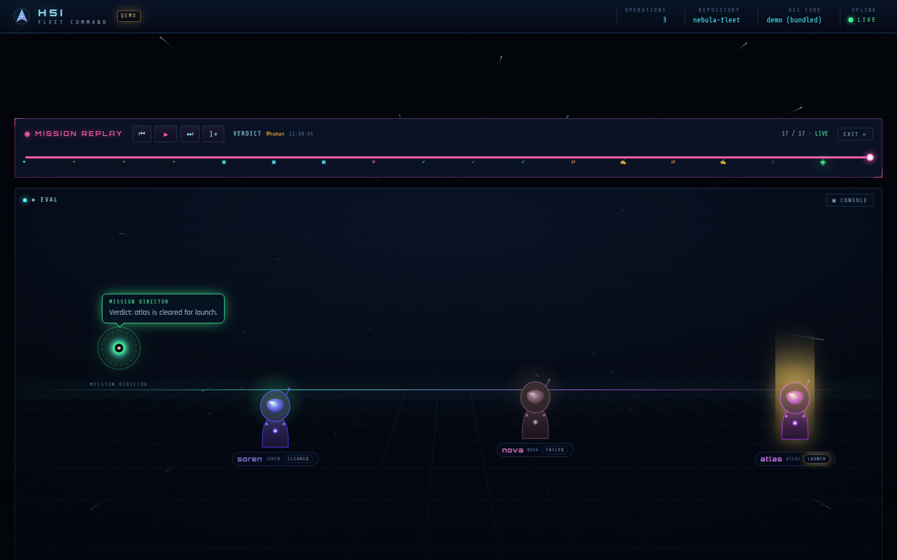
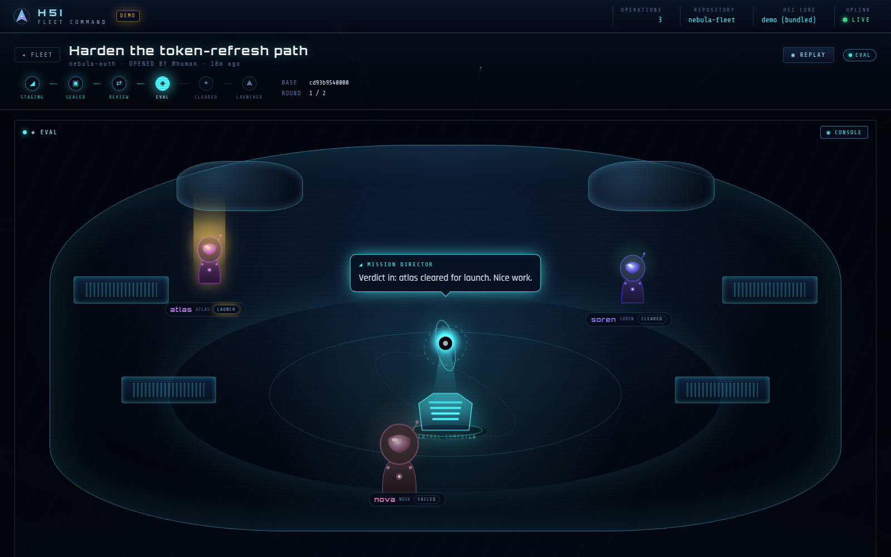

# H5I · Fleet Command

A **crewed-bridge viewer for [`h5i team`](https://github.com/Koukyosyumei/h5i)** — the
phased, evidence-publishing multi-agent collaboration feature of h5i.

Where the built-in `h5i serve` dashboard shows you the *data*, Fleet Command shows
you the *cast*. A team run isn't a table here — it's a **performance**. Each agent
is an anthropomorphised crew member (a helmeted pilot in their own livery) on the
ship's bridge; a **Mission Director** AI narrates; agents report in, speak their
actual reviews in speech bubbles, argue in discussion, get cleared or fail the
verifier, and the winner rises on a launch beam. Hit **replay** and the whole
operation is re-enacted on the timeline.

That anthropomorphism — agents-as-characters acting out the collaboration — is the
whole point, directly inspired by [`agmsg-office`](../agmsg-office) (a Moe-anime
viewer for `agmsg`), reimagined with a deep-space HUD aesthetic. The data console
(phase rail, candidate diffs, GO/NO-GO, event log) is still there, one click away,
for when you want the numbers.

> No mock data. Every pixel is rendered from the real `h5i` CLI running against a
> real repository (or the bundled `--demo` fleet).



> Try it instantly — no `h5i` or repo needed: `npx @h5i/studio --demo`

The Mission Director announces the verdict and the winning candidate launches:



The data console, one click away:



---

## The Bridge (the centerpiece)

The default view of an operation is the **Bridge** — a spaceship *meeting room*
(think Among Us) where the run is performed:

- **Crew** — each `h5i team` agent is a character drawn procedurally in its own
  livery (no image assets), **scattered around the room** with depth (nearer crew
  larger). Posture follows the story: bobbing on standby, leaning in with a speech
  bubble *on comms*, heads-down *reviewing*, shaking and greyed-out when the
  *verifier fails*, rising on a golden beam when *launched*.
- **Central computer** — the Mission Director sits in the **middle of the room** as
  a holographic AI core on a server pedestal (the fleet analogue of
  agmsg-office's boss character). It opens the operation, calls the round sealed,
  and announces the **GO / NO-GO** verdict, the whole core turning green or red.
- **Speech bubbles + caption** carry the *actual* text — a review body, a
  discussion message, "candidate sealed."
- **⛶ THEATER** expands the stage full-screen; **▣ CONSOLE** brings back the data
  panels below.

- **Radio chatter** — the `h5i msg` traffic between the crew (dispatch, acks,
  discussion) is woven into the same timeline and spoken on stage: a crew member
  voices its own transmissions; the human commander's radio is relayed by the
  Mission Director.

Combined with **replay**, the Bridge re-enacts the entire operation beat by beat —
team events and radio chatter interleaved chronologically on one scrubber.

## The console (the data, when you want it)

A team run (`h5i team`) is an event-sourced state machine. Below the Bridge,
Fleet Command renders every part of the lifecycle:

| Deck element | h5i concept | Source |
|---|---|---|
| **Fleet Operations** | all team runs, phase + crew + sealed count | `team list --json` |
| **Phase rail** | `draft → sealed → review → eval → cleared → launched` | `run.phase` |
| **Operative dossier** (tap a crew member) | env, isolation, runtime/model, state, live tool/exit, submission | `team status` + `team compare` + `msg team` |
| **Candidates** | sealed submissions: diff envelope, verifier gates, winner | `run.submissions` + `run.verifications` |
| **Flight Plan** (modal) | a submission's diff / summary / test evidence | `team artifact show` |
| **Comms Channel** | peer reviews, grants, discussion, crew radio | folded from events + `msg history` |

The verdict is shown in the room (the central computer announces GO/NO-GO) and as
the winning candidate's badge, rather than as a separate panel. The full event
log drives the replay scrubber. Tapping a crew member in the room opens their
dossier — the room *is* the squadron.

The console polls continuously (4 s on an open deck, 8 s ambient) with a LIVE /
IDLE / LOST uplink indicator.

### Mission Replay

Every team carries a timestamped, append-only event log, so any operation can be
**replayed**. Hit **◉ REPLAY** on a deck and the whole console becomes a
time-machine: a transport bar scrubs the timeline while the panels reconstruct
the exact state at the cursor — the phase rail advances, candidates seal in,
verifier gates flip, comms stream, and the GO / NO-GO lamp lights only once the
verdict is reached. Reconstruction is pure and client-side (it folds the event
prefix the same way the server's `derive()` does), so it works on live *and*
demo data. Play / pause, 1–8× speed, scrub, click any event tick, or jump to live.

### Demo mode

`--demo` serves a bundled, self-contained fleet — three missions including a
fully-played hero run (3 candidates, peer reviews, discussion, neutral
verification, a smallest-passing-diff verdict) — so you can see the
visualization and try replay without `h5i` or a repo. It's also what the
end-to-end tests run against, so the demo stays correct.

---

## Architecture

```
 browser (React + Vite, "Fleet Command" theme)
    │  fetch /api/*
    ▼
 Express read-only API  ──shells out──▶  h5i CLI  ──▶  refs/h5i/* (git)
 (server/ + vite dev middleware)
```

- **`server/h5i.mjs`** — the CLI bridge. `team` data comes from `--json`; `msg`
  and `recall context` (which have no `--json` in the installed CLI) are parsed
  from their human output by the pure functions in **`server/parse.mjs`**.
- **`server/derive.mjs`** — folds the append-only event log into the higher-order
  objects the installed `team status --json` doesn't include directly (the latest
  verdict, peer reviews, review grants, discussion).
- **`server/api.mjs`** — the read-only REST router, shared by **both** the
  standalone production server (`server/index.mjs`) and the Vite dev middleware
  (`vite.config.ts`). One source of truth, no drift.
- **`src/`** — the React SPA. A canvas warp-drift starfield, procedurally-drawn
  ship insignia (deterministic per call-sign — no image assets), and a HUD theme
  in a single `theme.css`.

Every API endpoint is a **pure read**: nothing the viewer does advances a team
run's state. (The verdict is derived from the existing event log rather than by
invoking `team finalize`, which would append a new event.)

### API

```
GET /api/health                                 service + repo + h5i version
GET /api/teams                                  TeamRun[]
GET /api/teams/:id                              { run, events, derived }
GET /api/teams/:id/compare                      CompareRow[]
GET /api/teams/:id/artifact/:artifactId?view=   diff | summary | tests
GET /api/messages?limit=                        cross-agent radio (newest first)
GET /api/roster                                 message-channel roster
GET /api/context                                shared reasoning workspace
```

---

## Install & run

Requirements: **Node ≥ 18**, the **`h5i`** binary on `PATH`.

### Try the demo first

No `h5i`, no repo, no setup — explore a bundled 3-mission fleet (with replay):

```bash
npx @h5i/studio --demo
```

### As a tool (recommended)

No install needed — run it in any h5i repo:

```bash
npx @h5i/studio                 # view the repo in the current directory
npx @h5i/studio -r ../project   # view another repo
npx @h5i/studio -p 9000 --no-open
```

Or install it for repeated use:

```bash
npm i -g @h5i/studio
h5i-studio                      # opens the console in your browser
```

```
OPTIONS
  -r, --repo <path>    h5i repository to view   (default: cwd)
  -p, --port <n>       port to listen on        (default: 8787)
      --host <host>    host/interface to bind   (default: 127.0.0.1)
      --bin <path>     path to the h5i binary   (default: h5i on PATH)
      --demo           serve the bundled demo fleet (no h5i / repo needed)
      --no-open        do not open the browser
```

Environment equivalents: `H5I_REPO`, `H5I_BIN`, `PORT`, `HOST`.

### From source

```bash
npm install

# Dev — Vite HMR + live API in one process (http://localhost:5180)
npm run dev

# Production — build the SPA, then serve it + the API on one port
npm run build
H5I_REPO=/path/to/your/h5i/repo PORT=8787 npm run serve
```

### Seeing data

Fleet Command shows whatever team runs exist on the target clone. To create one:

```bash
h5i env create alice && h5i env create bob
h5i team create my-run --title "Refactor auth" --rounds 2
h5i team add-env my-run alice
h5i team add-env my-run bob
# … agents work in their envs, then:
h5i team submit my-run --agent <id>
h5i team freeze my-run
h5i team verify my-run --agent <id> -- <test cmd>
h5i team finalize my-run
```

---

## Tests

```bash
npm test         # parsers + event-fold + live API integration  (no browser)
npm run test:e2e # Playwright DOM e2e against the built SPA      (optional)
npm run test:all # everything
```

- **`test/parse.test.mjs`** — the CLI-text parsers, against fixtures captured
  verbatim from the real `h5i` 0.2.x CLI (msg history plain+rich merge, roster,
  context, ANSI stripping).
- **`test/derive.test.mjs`** — the event-log projection: verdict precedence
  (a later `verdict` overrides an earlier `no_verdict`), reviews, grants,
  discussion, and totality over empty input.
- **`test/api.test.mjs`** — boots the real Express router over HTTP against the
  live `h5i` CLI; team-specific cases skip (not fail) when no team is present, so
  the suite is green on a fresh clone.
- **`test/e2e.test.mjs`** — drives a real Chromium via Playwright, asserting the
  deck renders from live data with no runtime errors. Self-skips when the bundle
  isn't built or no browser is available.

---

## Releasing

Published to npm as **`@h5i/studio`**. The tarball ships the pre-built `dist/`
plus the Express server (`prepack` builds it); `vite`/`react` stay devDeps and
are never installed by consumers — the only runtime dependency is `express`.

```bash
npm version patch        # bump package.json + create the git tag
git push --follow-tags   # → .github/workflows/release.yml publishes on the v* tag
```

The release workflow typechecks, tests, builds, verifies the tag matches the
package version, and runs `npm publish --provenance --access public`. It needs a
repo secret **`NPM_TOKEN`** (an npm automation token). To publish by hand:
`npm publish` (runs `prepack` → build automatically). `npm pack --dry-run`
previews the exact tarball.

## Theme notes

- Palette: deep-space navy void, phosphor cyan, hazard amber, plasma magenta,
  go-green. Corner-bracketed glass panels, scanline + vignette overlays.
- Type: Orbitron (display), Rajdhani (UI), Share Tech Mono (instrument data).
- Each agent's craft + livery hue is a deterministic hash of its call-sign, so an
  operative reads as the same ship everywhere — generated as SVG, zero assets.
- Respects `prefers-reduced-motion` (the starfield holds still).
